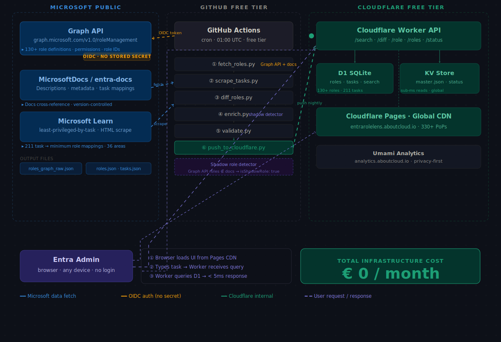

<div align="center">


[](https://entrarolelens.aboutcloud.io)
[](https://github.com/arusso-aboutcloud/entra-rolelens/actions)
[](https://github.com/arusso-aboutcloud/entra-rolelens/commits/master)
[](LICENSE)

[](https://entrarolelens.aboutcloud.io)
[](https://entrarolelens.aboutcloud.io)
[](https://github.com/arusso-aboutcloud/entra-rolelens/actions)
[](CONTRIBUTING.md)

[](https://www.linkedin.com/in/antonio-russo-9295731b/)

</div>

---

## Architecture

> Click the diagram to open full size

[](assets/architecture.svg)

---

## What is RoleLens?

You describe a task — *"reset a user's MFA"*, *"read audit logs"*, *"manage Conditional Access policies"* — and RoleLens returns the minimum built-in Entra ID role required to do it, and nothing more. You can also compare two roles side by side and see exactly what one has that the other lacks, permission by permission.

The entire Entra ID built-in role catalog refreshes daily from Microsoft's public APIs. When Microsoft adds a new role, removes a permission, or renames something — which happens regularly — the tool knows by morning.

**It replaces the 50-tab Microsoft docs crawl that every Entra admin does when someone asks: "what role do I assign without giving them too much?"**

---

## Features

| Mode | What it does |
|------|-------------|
| **Task → Role** | Describe what you need to do in plain language. Get back the minimum built-in role, why it qualifies, and any privilege warnings. |
| **Role Diff** | Select any two built-in roles. See every permission one has that the other lacks, in a clean side-by-side view. |
| **Change Feed** | Every role change Microsoft has made since launch, diffed and timestamped. A searchable record nobody else publishes. |

---

## Why no AI?

By design. This is a selling point, not a limitation.

> Every result is derived directly from Microsoft's official role definitions and documentation, refreshed daily. No language model, no hallucination risk. If it says *Authentication Administrator*, that is what Microsoft's own published data says.

Security professionals who would trust this tool are exactly the people who distrust LLM-generated role recommendations for production IAM decisions. The deterministic engine is the trust signal.

---

## How it works

Three public Microsoft sources, harvested daily:

```
Microsoft Graph API          →  roles.json       (full role catalog + permissions)
Microsoft Learn /least-priv  →  tasks.json       (task → minimum role mappings)
Graph Changelog RSS          →  change detection (skip heavy jobs if nothing changed)
```

The nightly pipeline (GitHub Actions, free tier):

```
01:00 UTC
  │
  ├── CHECK    read Graph changelog RSS — skip if no role changes
  ├── FETCH    GET graph.microsoft.com/roleDefinitions
  ├── SCRAPE   learn.microsoft.com/least-privileged-by-task
  ├── DIFF     compare today vs yesterday → changelog.json
  ├── ENRICH   cross-reference → master.json + role_diff_matrix.json
  ├── VALIDATE schema check → auto-open GitHub Issue if invalid
  └── PUSH     Cloudflare KV (live ruleset) + D1 (audit trail) + GitHub (version history)
```

Search is pure SQL — keyword extraction in JS, weighted match against a `task_search` table, results in under 2ms. No LLM in the hot path.

---

## Project structure

```
entra-rolelens/
├── .github/
│   ├── workflows/
│   │   └── refresh.yml        # Nightly pipeline — runs automatically
│   └── ISSUE_TEMPLATE/        # missing_task.md · bug_report.md
├── pipeline/                  # Python scripts — run by GitHub Actions
│   ├── fetch_roles.py         # Fetches role definitions
│   ├── scrape_tasks.py        # Scrapes task→role mappings
│   ├── diff_roles.py          # Detects role changes
│   ├── enrich.py              # Builds master.json
│   ├── validate.py            # Quality gate
│   └── push_to_cloudflare.py  # Writes to KV + D1
├── worker/                    # Cloudflare Worker — TypeScript API
│   ├── src/index.ts           # 5 routes: search, diff, role, roles, status
│   └── wrangler.toml
├── frontend/                  # Static UI — deployed to Cloudflare Pages
│   └── index.html             # Single file · dark theme · no framework
├── data/                      # Auto-committed nightly by the pipeline
│   ├── roles.json             # 130 built-in roles + permissions
│   ├── tasks.json             # 211 task → role mappings
│   ├── master.json            # Merged dataset pushed to KV
│   ├── changelog.json         # Role changes detected this run
│   └── previous_roles.json    # Yesterday's snapshot for diffing
└── assets/
├── architecture.svg       # System architecture diagram
└── banner.svg             # Pixel art banner

```

---

## Data sources

| Source | URL | Used for |
|--------|-----|----------|
| Microsoft Graph API | `graph.microsoft.com/v1.0/roleManagement/directory/roleDefinitions` | Role catalog, permissions — no auth required |
| Microsoft Learn | `learn.microsoft.com/en-us/entra/identity/role-based-access-control/delegate-by-task` | Task → role mappings |
| Graph Changelog RSS | `developer.microsoft.com/en-us/graph/changelog/rss` | Change detection gate |

---

## Contributing

The task → role mappings live in [`data/tasks.json`](data/tasks.json) — a human-readable JSON file that anyone can correct or extend.

If a mapping is wrong, a task is missing, or a role recommendation is outdated:

1. Fork the repo
2. Edit `data/tasks.json`
3. Open a PR with a link to the Microsoft Learn source

Every merged PR triggers the pipeline and goes live within minutes. The community is the quality layer.

See [CONTRIBUTING.md](CONTRIBUTING.md) for guidelines.

---

## Infrastructure cost

| Component | Cost |
|-----------|------|
| GitHub Actions (nightly pipeline, ~3 min/day) | €0 — free tier covers 2,000 min/month |
| Cloudflare Workers + KV | €0 — free tier |
| Cloudflare D1 (SQLite) | €0 — free tier |
| Domain (`aboutcloud.io`) | Already owned |

**Total recurring cost: €0**

---

## Roadmap

- [ ] Task → Role search (v1)
- [ ] Role Diff view (v1)
- [ ] Nightly refresh pipeline
- [ ] Change feed / "recently modified" badges
- [ ] Privilege risk indicators
- [ ] API endpoint (`/api/task?q=reset+mfa`)
- [ ] Bulk role audit (paste a list of roles, get overlap analysis)

---

## License

MIT — see [LICENSE](LICENSE)

---

<div align="center">
  <sub>Built on Microsoft's public data. Not affiliated with or endorsed by Microsoft.</sub>
</div>
