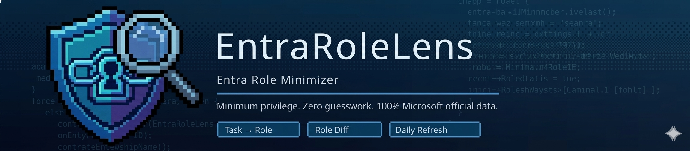
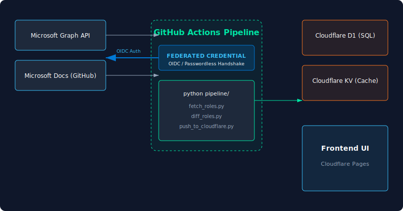
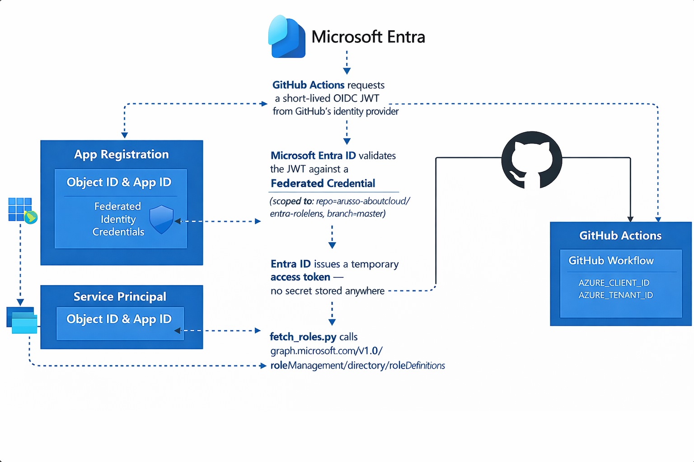

<div align="center">



# Entra RoleLens

[](https://entrarolelens.aboutcloud.io)
[](https://github.com/arusso-aboutcloud/entra-rolelens/actions)
[](https://github.com/arusso-aboutcloud/entra-rolelens/commits/master)
[](LICENSE)
[](https://entrarolelens.aboutcloud.io)
[](https://entrarolelens.aboutcloud.io)
[](https://entrarolelens.aboutcloud.io)
[](https://github.com/arusso-aboutcloud/entra-rolelens/stargazers)
[](CONTRIBUTING.md)

[](https://www.linkedin.com/in/antonio-russo-9295731b/)

**[entrarolelens.aboutcloud.io](https://entrarolelens.aboutcloud.io)** · [Report a mapping error](https://github.com/arusso-aboutcloud/entra-rolelens/issues) · [Request a task](https://github.com/arusso-aboutcloud/entra-rolelens/issues)

</div>

---

## What is Entra RoleLens?

You describe a task — *"reset a user's MFA"*, *"read audit logs"*, *"manage Conditional Access policies"* — and Entra RoleLens returns the minimum built-in Entra ID role required to do it, and nothing more. You can also compare any two roles side by side and see exactly what one has that the other lacks, permission by permission.

**It replaces the 50-tab Microsoft docs crawl that every Entra admin does when someone asks: "what role do I assign without giving them too much?"**

---

## Features

| Mode | What it does |
|------|-------------|
| **Task → Role** | Describe what you need to do in plain language. Get back the minimum built-in role, a direct link to Microsoft's source, and a privilege warning if the role is elevated. |
| **Role Diff** | Select any two built-in roles. See every permission one has that the other lacks in a clean three-column view — unique to A, shared, unique to B. |
| **Shadow Detection** | Roles present in the Graph API but absent from public documentation are flagged as `isShadowRole: true` — catching unreleased Microsoft roles before announcement. |
| **Always current** | The full role catalog and task mappings refresh nightly via a secure, passwordless OIDC pipeline. Every change Microsoft makes is detected, logged, and live by morning. |

---

## Shadow role detection

Entra RoleLens cross-references the live Microsoft Graph API against Microsoft's public documentation on every nightly run. Roles that exist in the API but are not yet documented are flagged as **shadow roles** — this means the tool can surface new Microsoft roles before they appear in any documentation.

The shadow role count is logged in every pipeline run and visible in the pipeline status endpoint:
`GET /api/status` → `shadow_role_count`

---

## What's new

> Auto-generated from the nightly pipeline · Last updated by GitHub Actions

<!-- WHATS_NEW_START -->
- Corpus now honestly reflects scope — 30 Azure RBAC tasks tagged `out_of_scope` instead of silently dropped, no more phantom empty results for Connect Health or MFA Server queries
- Pill integration tests added to the nightly pipeline — 15 documented search expectations validated against the live worker every night, regressions auto-open a GitHub issue only for genuine new regressions (known failures suppressed via `KNOWN_FAILURES` list)
- Test harness now mirrors the real user path — pill queries routed through the same synonym expansion the frontend uses; `restore deleted users` fixed and verified passing end-to-end
- Fixed a category of query-hijack bug in the synonym reverse-map — common English words like `users` can no longer silently reroute unrelated queries to the wrong role (stopword guard applied identically in frontend and pipeline)
- 26 curated tasks explicitly tagged `synthetic: true` in `tasks.json` — clear distinction between Microsoft Learn scraped content and hand-curated coverage for role families the docs don't cover yet (Agent Identity, Tenant Governance, Entra Backup)
<!-- WHATS_NEW_END -->

---

## Architecture

[](assets/pipeline-auth.svg)

---

## Code quality

This codebase is continuously monitored for structural quality. Every nightly pipeline run validates that the architectural rules in [`.sentrux/rules.toml`](.sentrux/rules.toml) hold, and reports the latest quality score below.

The check runs via [Sentrux](https://github.com/sentrux/sentrux), a free open-source structural quality gate. The score reflects metrics like cyclic-dependency count, coupling between modules, and file-size distribution — informational only, never blocking the pipeline.

<!-- SENTRUX_QUALITY_START -->
- Last quality score: **—** — will populate after first nightly run
<!-- SENTRUX_QUALITY_END -->

---

## Technical stack

| Layer | Technology | Cost |
|-------|-----------|------|
| Frontend | Cloudflare Pages · Global CDN · 330+ PoPs | €0 |
| API | Cloudflare Workers · TypeScript · 5 routes | €0 |
| Database | Cloudflare D1 · SQLite · 130+ roles · 211 tasks | €0 |
| Cache | Cloudflare KV · master.json · pipeline_status | €0 |
| Auth | Entra ID · Workload Identity Federation · OIDC | €0 |
| Pipeline | GitHub Actions · Python 3.11 · nightly cron | €0 |
| Analytics | Umami · self-hosted · privacy-first | €0 |
| Domain | aboutcloud.io · already owned | €0 |
| **Total** | | **€0 / month** |

**Search engine:** Pure SQL keyword matching against a weighted `task_search` table. Keywords extracted in the Worker, matched against D1. No LLM in the query path. Median response time: **< 5ms**.

---

## Passwordless pipeline — how authentication works

The nightly pipeline authenticates to Microsoft Entra ID without any stored credentials using **Workload Identity Federation**:

[](assets/pipeline-auth.png)

```
GitHub Actions requests a short-lived OIDC JWT from GitHub's identity provider
        │
        ▼
Microsoft Entra ID validates the JWT against a Federated Credential
  (scoped to: repo=arusso-aboutcloud/entra-rolelens, branch=master)
        │
        ▼
Entra ID issues a temporary access token — no secret stored anywhere
        │
        ▼
fetch_roles.py calls graph.microsoft.com/v1.0/roleManagement/directory/roleDefinitions
```

GitHub secrets required: `AZURE_CLIENT_ID` + `AZURE_TENANT_ID` only. No client secret. No certificate.

---

## How it stays accurate — the self-sustaining pipeline

This tool requires zero manual maintenance for daily operation. Every night at **01:00 UTC**, a GitHub Actions workflow runs automatically:

```
01:00 UTC — GitHub Actions wakes up (free tier · ~3 min runtime)
│
├── azure/login@v2     OIDC handshake → temporary Entra access token
│                      (Workload Identity Federation · EntraRoleFetcher-API)
│
├── fetch_roles.py     Calls Microsoft Graph API via OIDC token (live source of truth)
│   ├── Graph API      graph.microsoft.com/v1.0/roleManagement/directory/roleDefinitions
│   │                  Authenticated via OIDC token
│   │                  → data/roles_graph_raw.json  (source of truth for IDs + permissions)
│   └── Docs scrape    Also scrapes MicrosoftDocs/entra-docs for descriptions
│                      → data/roles.json            (human-readable metadata)
│
├── scrape_tasks.py    Scrapes the Microsoft Learn least-privileged-by-task page
│                      Parses 211 task → minimum role mappings across 36 feature areas
│                      → data/tasks.json
│
├── diff_roles.py      Compares today's roles against yesterday's snapshot
│                      Detects ADDED, REMOVED, and MODIFIED roles
│                      Logs every change with timestamp to D1 role_changes table
│
├── enrich.py          Cross-references roles_graph_raw.json vs roles.json
│                      Roles in Graph API but not in docs → isShadowRole: true
│                      Builds master.json and resolves role names to IDs
│
├── validate.py        Schema and quality checks
│                      On failure: auto-opens a GitHub Issue and aborts the push
│                      The live data is never overwritten with invalid data
│
└── push_to_cloudflare.py
                       Pushes master.json to Cloudflare KV (global cache)
                       Upserts all roles and tasks to Cloudflare D1 (SQLite)
                       Logs changelog entries to D1 role_changes table
                       Commits updated data files back to this repo
```

**If the pipeline fails** — a GitHub Issue is opened automatically. The previous night's data stays live. Nothing breaks for users.

**The commit history** of this repo is a permanent, searchable record of every role change Microsoft has made since launch.

---

## Project structure

```
entra-rolelens/
├── .github/
│   ├── workflows/
│   │   └── refresh.yml            # Nightly pipeline — OIDC auth + dual data sources
│   └── ISSUE_TEMPLATE/            # missing_task.md · bug_report.md
├── pipeline/                      # Python scripts — run by GitHub Actions
│   ├── fetch_roles.py             # Graph API (OIDC) + docs scrape — dual source
│   ├── scrape_tasks.py            # Scrapes task → role mappings
│   ├── diff_roles.py              # Detects role changes
│   ├── enrich.py                  # Shadow role detection + builds master.json
│   ├── validate.py                # Quality gate
│   └── push_to_cloudflare.py      # Writes to KV + D1
├── worker/                        # Cloudflare Worker — TypeScript API
│   ├── src/index.ts               # 5 routes: search, diff, role, roles, status
│   └── wrangler.toml
├── frontend/                      # Static UI — deployed to Cloudflare Pages
│   └── index.html                 # Single file · dark theme · no framework
├── data/                          # Auto-committed nightly by the pipeline
│   ├── roles_graph_raw.json       # Live Graph API response — source of truth
│   ├── roles.json                 # Docs-sourced role metadata
│   ├── tasks.json                 # 211 task → role mappings
│   ├── master.json                # Merged dataset pushed to KV
│   ├── changelog.json             # Role changes detected this run
│   └── previous_roles.json        # Yesterday's snapshot for diffing
└── assets/
    ├── architecture.svg           # System architecture diagram
    └── project-banner.png         # Project banner
```

---

## Data sources

| Source | URL | Used for |
|--------|-----|----------|
| Microsoft Graph API | `graph.microsoft.com/v1.0/roleManagement/directory/roleDefinitions` | Live role definitions · OIDC authenticated · source of truth |
| MicrosoftDocs/entra-docs | `github.com/MicrosoftDocs/entra-docs` | Role descriptions · metadata |
| Microsoft Learn | `learn.microsoft.com/.../delegate-by-task` | Task → minimum role mappings · 211 tasks |

**Why dual sources?** The Graph API is the authoritative source for role IDs and permissions but does not expose task → role mappings. The documentation scrape fills that gap. Together they enable the shadow role detector: roles that Microsoft has deployed to the API but not yet announced in documentation.

---

## Data quality
<!-- DATA_QUALITY_START -->
- Indexed a total of **143 roles** to map user tasks precisely.
- Mapped **246 tasks** to help users identify the required roles efficiently.
- Detected **13 shadow (unlisted) roles**, ensuring awareness of roles that may not be officially documented.
<!-- DATA_QUALITY_END -->

## Contributing

The task dataset lives in [`data/tasks.json`](data/tasks.json). If a mapping is wrong, a task is missing, or a role recommendation is outdated:

1. Check the [Microsoft Learn least-privileged-by-task](https://learn.microsoft.com/en-us/entra/identity/role-based-access-control/delegate-by-task) page for the authoritative mapping
2. Open an [issue](https://github.com/arusso-aboutcloud/entra-rolelens/issues) with the task description and the Microsoft Learn source URL
3. Or submit a PR directly to `data/tasks.json` — see [CONTRIBUTING.md](CONTRIBUTING.md)

Every merged contribution is picked up by the nightly pipeline and live within minutes.

---

## License

MIT — see [LICENSE](LICENSE)

---

<div align="center">
  <sub>Built on Microsoft's public data · Not affiliated with or endorsed by Microsoft</sub><br>
  <sub>Made by <a href="https://aboutcloud.io">aboutcloud.io</a> ·
  <a href="https://www.linkedin.com/in/antonio-russo-9295731b/">Antonio Russo</a></sub>
</div>
